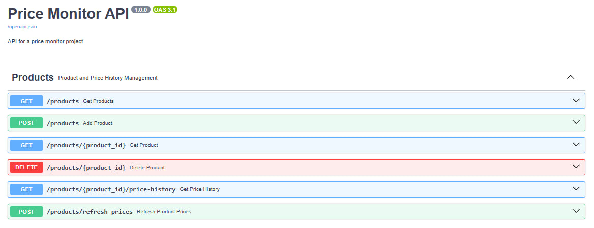

# Price Monitor API

A FastAPI application for adding products, retrieving their current prices, and storing price history.

The project demonstrates backend development, web scraping, database integration, data validation, logging, and automated testing.

## Project Status

The core API is functional.

Currently, the application can:

* add products for monitoring;
* retrieve the current product price;
* store products in a database;
* save price changes;
* return product price history;
* update product prices manually through the API.

Automatic scheduled checks and Telegram notifications are planned.

## Demo



## Features

* Product creation through a REST API
* Product URL validation
* Current price retrieval
* Product storage in SQLite
* Price history storage
* Manual price updates
* Structured logging
* Error handling
* Interactive Swagger documentation
* Automated tests

## How It Works

```text
Client request
    ↓
FastAPI endpoint
    ↓
Request validation
    ↓
Product page parsing
    ↓
Database operation
    ↓
JSON response
```

When a product is added, the application retrieves its current price and stores the product in the database.

When the price is updated, a new price history record is created.

## Tech Stack

* Python
* FastAPI
* Pydantic
* SQLite
* BeautifulSoup
* Requests
* Pytest
* Uvicorn

## API Endpoints

| Method   | Endpoint                               | Description            |
| -------- |----------------------------------------|------------------------|
| `POST`   | `/products`                            | Add a product          |
| `GET`    | `/products`                            | Return all products    |
| `GET`    | `/products/{product_id}`               | Return one product     |
| `POST`   | `/products/refresh-prices`             | Refresh product prices |
| `GET`    | `/products/{product_id}/price-history` | Return price history   |
| `DELETE` | `/products/{product_id}`               | Delete a product       |

Full interactive API documentation is available after startup:

```text
http://127.0.0.1:8000/docs
```

## Project Structure

```text
price-monitor-api/
├── src/
│   └── price_monitor_api/
│       ├── api.py
│       ├── config.py
│       ├── database.py
│       ├── main.py
│       ├── models.py
│       └── parser.py
├── tests/
│    ├── fixtures/
│    │    └── steam/
│    │        ├── age_gate.html
│    │        ├── discounted_product.html
│    │        ├── free_to_play.html
│    │        └── regular_product.html
│    ├── api/
│    │    ├── test_history.py
│    │    ├── test_products.py
│    │    └── test_refresh_prices.py
│    ├── conftest.py
│    ├── test_database.py
│    ├── test_main.py
│    └── test_parser.py
├── requirements.txt
├── pyproject.toml
├── .gitignore
└── README.md
```

## Installation

Clone the repository:

```bash
git clone https://github.com/herdlich/price-monitor-api.git
cd price-monitor-api
```

Create and activate a virtual environment:

```bash
python -m venv .venv
```

Windows:

```bash
.venv\Scripts\activate
```

Linux and macOS:

```bash
source .venv/bin/activate
```

Install dependencies:

```bash
pip install -r requirements.txt
```

## Running the Application

Start the development server:

```bash
uvicorn price_monitor_api.api:app --reload
```

Open Swagger UI:

```text
http://127.0.0.1:8000/docs
```

## Usage Example

Add a product:

```bash
curl -X POST "http://127.0.0.1:8000/products" \
  -H "Content-Type: application/json" \
  -d '{
    "link": "https://store.steampowered.com/app/730/CounterStrike_2/"
  }'
```

Example response:

```json
{
  "id": 1,
  "name": "Example product",
  "price": 9.99,
  "currency": "€",
  "discount": "No discount",
  "link": "https://example.com/product",
  "created_at": "25-07-2025 10:22:16"
}
```

## Tests

Run all tests:

```bash
pytest
```

Run tests with detailed output:

```bash
pytest -v
```

## Roadmap

* [x] Add products
* [x] Retrieve current prices
* [x] Store products in a database
* [x] Store price history
* [x] Provide REST API endpoints
* [x] Add logging
* [x] Add automated tests
* [ ] Automatically check all products on schedule
* [ ] Send Telegram notifications about price changes
* [ ] Add PostgreSQL support
* [ ] Add Alembic migrations
* [ ] Add Docker configuration
* [ ] Deploy the application

## Current Limitations

* Price updates must currently be triggered manually.
* Telegram notifications are not implemented yet.
* The application currently supports Steam Store product pages only.
* Website layout changes may break price extraction.
* SQLite is used for local development.
